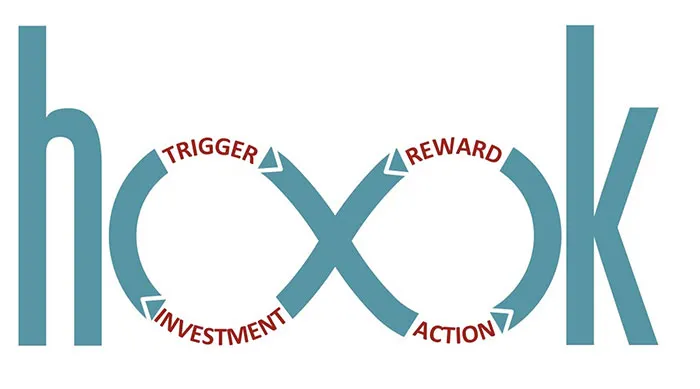

Have you ever wondered why some applications will succeed while others which are just as capable never seem to take off?
Facebook wasn't the first social network, yet somehow it managed to succeed over MySpace and Friendster. Photo sharing is
nothing new either, Flickr existed long before Instagram, yet it stayed a niche product while the latter flourished. Most
successful applications were not the first to their space, it just became a habit for their users to use their application.
So if you want to have a successful application, you need to make sure it's easy to form a habit around it.

## Find A Trigger.

When formulating a new habit, you must figure out what will trigger the user to carry out the desired action. This trigger
can be internal, meaning it comes from the user's memory, or external, meaning it is found in the user's environment. 
Triggers are often fairly basic, so keep them simple. An internal trigger could be feeling lonely while an external 
trigger could be a push notification on the user's mobile device.

I check Facebook when I'm feeling lonely or disconnected from others. It makes sense why I would do this because I'm 
trying to get some sort of social interaction and Facebook is a collection of (almost) everyone I know. Sometimes I feel 
less lonely after checking Facebook, other times I don't. That isn't a flaw and is actually crucial with building a strong 
habit which I'll get to a little later.

On the flip-side, I recently installed RetailMeNot and have not yet formed an internal habit of using their app when I 
want to save money. They send me a push notification every so often to let me know that there are some deals in my area, 
which makes me open the application. This is an external trigger that could eventually lead to an internal trigger of 
"I want to save money."

That's another thing to keep in mind about triggers. You can have both external and internal triggers which result in the 
same action. If Facebook were starting out today, they could send me a push notification every night when they notice I 
am at home. Heck, they could go one step further and notify me if I've been on my phone for more than 30 minutes without 
opening the app since it'd be fair to assume that I'm alone and likely want some social interaction. From there it'd build 
to an internal trigger that'd make me check the app anytime I felt lonely or disconnected.

So figure out what you want your user to do and create a trigger for that.

## What Is The Desired Action?

This is incredibly important to creating a new habit. You can have the best trigger in the world, but if your user doesn't 
complete the action, no habit will be formed. The desired action should be easy to complete. The harder the action is to 
complete, the more likely it is that your users will not complete it.

Find out what motivates your users. A good starting point is to keep in mind that as humans we seek pleasure and avoid 
pain. We also look for hope while shutting our eyes to painful experiences. We also cling to social acceptance and run 
away from rejection. When you are designing your application, you should make sure that the actions your users take are 
enjoyable ones, they should give them some sort of pleasure. If your application is a social networking application, it 
shouldn't make them feel lonely.

Also, if the goal of your application is to reach critical mass, make sure these actions are accessible. People were 
sharing content long before Pinterest came around, but the platform itself made the process stupid easy. Not only that, 
but it was made for content creation and sharing. Platforms like tumblr and Facebook allow for content creation, but they 
also force the people who subscribe to your updates to endure all of you. Pinterest's system of boards lets you subscribe 
to some things while ignoring others; thus the experience is both painless and enjoyable.

Make sure you have clearly defined actions for your application. Make sure those actions are easy to complete and make 
sure they keep your user motivated to keep using the application.

## What's The Variable Reward?

Everyone likes being rewarded, it's what keeps us motivated. With applications this can come in the form of gaining badges, 
getting likes, or unlocking some super cool piece of armor (if we are playing a video game). These are not constant rewards 
though. Sometimes you'll post to Facebook and get two likes, while other times you'll get 20 or more. If you knew every post 
on Facebook would get you the same number of likes, you probably would be less intrigued to use the platform. It's a rush 
signing in to Facebook to see if you have any new notifications, to see how many people liked that cat picture of Mr. Meowy.

Let's dive deeper, though. Why is the variable reward so much better than a constant one? After all, if you are playing 
a video game like World of Warcraft, your goal is to get the best gear possible. While that is true, the reason someone 
plays isn't to actually get the gear; it's to hunt for that gear. It's more fun to hunt for the gear than it is to actually 
get it, once you get the gear, your mission is over, and now you have to find the motivation to start on your next one.

So make sure there is some kind of variable reward built into your habit. If that variable reward creates a habit in-itself 
(checking to see how many likes your picture got), then that's even better.

## Make Your User Feel Invested.

The final part of building a habit is giving a sense of investment. Once your users feel invested in your application, 
it's a lot harder to get them to leave for a competing product. The easiest example I can think of for this is LinkedIn. 
When you sign up they have a progress bar that shows how far away you are from having an all-star profile. This progress 
bar gives you a small sense of accomplishment by completing your profile, and at the same time it gets you to be more 
invested in the product. Currently, I have over 500 connections on LinkedIn, I get random job offers weekly, I'm in no 
rush to find another professional networking application because of the investment I've made. If I wasn't so invested, 
I'd be more apt to jump ship.

Another example I can think of is Google+ with automatic photo uploads. This isn't really obvious until you really think 
about it, but you are essentially uploading all of your memories to Google+ without doing anything. Then periodically with 
Auto Awesome you'll get an update to take a look at your recent trip out of state or look at your last year in a 1-minute 
video. All it took was one check-box to automatically upload your photos to Google+, and now you are invested in the product. 
This is the killer product for Google+, and I'm not even sure if Google realizes it, but they have a killer product and 
Facebook should be very worried.

That's all I have time for. Hopefully, this gives you a brief overview of how to build a better application by introducing 
habits into it. If you'd like to learn more, I strongly recommend checking out the recommended readings I've outlined below.

## Recommended Reading

[Hooked: How to Build Habit-Forming Products](https://amzn.to/4aNLVR0) → This article was inspired by this book by Nir
Eyal. Highly recommend picking this up if you enjoyed this article.

[The Power of Habit: Why We Do What We Do in Life and Business](https://amzn.to/4leiMSI) → This dives deeper into how
habits are actually formed. It's less about building applications, and more about habits. This is also a great read if
you want deeper insight about what habits are.