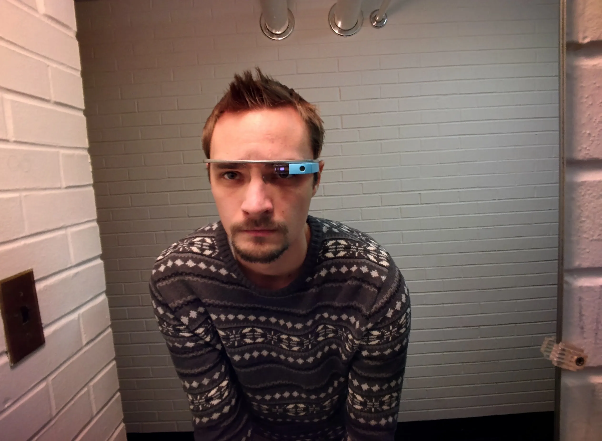
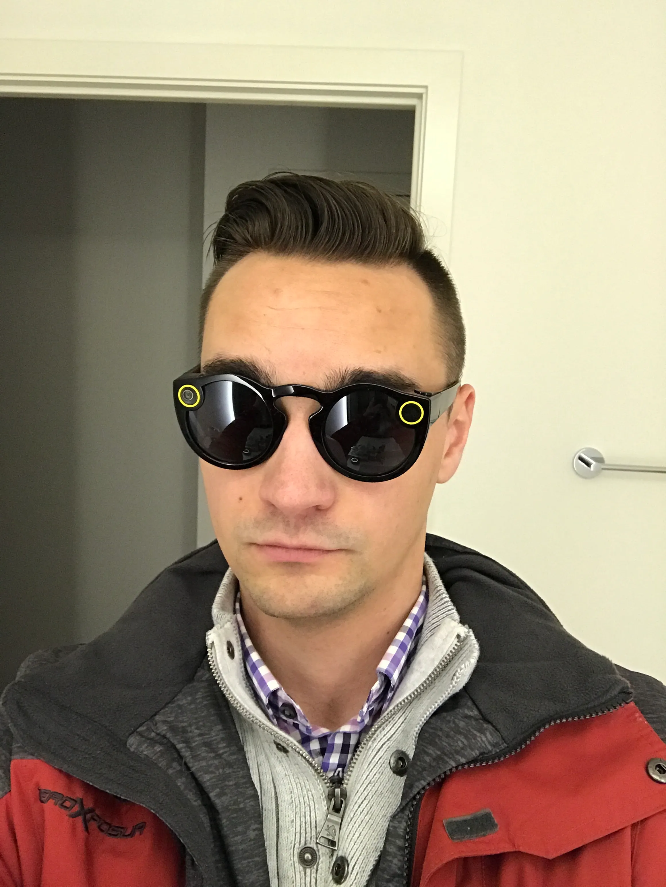

Once upon a time I was one of eight thousand people selected to purchase Google Glass. So in June of 2013 I got in my car and drove from Chicago to New York City to pick them up. The car ride was roughly thirteen hours and I only almost fell asleep twice at the wheel; to say the trip was worth it was an understatement. You see, Google Glass was an ambitious device that taught us how to design small, glance-able apps. If you own a smartwatch then you have Glass to thank for smoothing out the rough edges.

Of course the media grabbed hold of this technology and through a never-ending campaign of fear mongering they helped to prevent the device from reaching a wide consumer audience. That, and they looked incredibly dorky, were incredibly expensive ($1,500, but why?), and had legal obstacles to jump through when it came to distracted driving laws.

## Snapchat Spectacles

In comes the new kid on the block, Snap Inc. three years later with a device that is over ten times cheaper, does roughly ten times less, and looks ten times less dorky (though it is still dorky). As soon as I heard about the product I knew I had to have them and thanks to a friend living in New York City, I was able to get them earlier this week.

While I haven’t had a ton of time to play around with Spectacles, I have a feeling that Snap Inc. might be onto something big. For starters, the **setup process** was a breeze, put on the glasses, open Snapchat, and then look at the snap code to pair your glasses to your account. To contrast, I had to go out to Google’s office in the Chelsea Market of NYC and have a Glass Specialist walk me through everything. Of course, the product also did significantly more than take videos (it could even take pictures).

**So before I talk about the good stuff**, let me complain about Spectacles. For starters, I have yet to find a way to take a picture with these things. I understand that consumer trust is probably a major factor, but Spectacles could simply add a several second delay where the LED indicators blink to alert others that something the wearer is doing something. Don’t get wrong, sharing my life ten seconds at a time is great, but POV pictures are just as great (if not greater) than POV video. There’s also a complete lack of voice commands, which considering the $129 price tag, I suppose makes sense. Still though, it’d be nice to say “Yo Specs, record this”. That’s it, I was only able to find two things I dislike about things, excuse me while I pat myself on the back.

## What I Like About Spectacles

As I already mentioned, the setup process was super simple. The charging process is also incredibly simple, the case that they come in serves as the charging dock for your Specs, and when you take them out the box initially it has a fully charged battery. There is something very natural about putting glasses inside of a case in the evening; it was kind of strange to have to plug in Glass every night or remember to bring my charger if I was going away for the weekend. With Spectacles you only need to remember the case.

Taking video is incredibly easy, there is a button in the top left corner and as soon as you press the button the camera in the top right corner begins recording. There is are two LED indicators on the left side (one facing the stuff you are recording, and the other facing your eye) which light up as you are recording, when the ten seconds is about up it will begin to blink to let you know.

While Spectacles look dorky they are also sort of stealthy. When I wore Google Glass around I had no fewer than ten people per day ask me about my “Google Glasses” or “Google Goggles” and even more people would talk about them as I passed by without actually acknowledging me. It was annoying. In the few days I’ve had Spectacles I’ve worn them around a small town, on a busy train ride home, and through the city. I have had exactly zero people talk about them in passing. It is awesome, and to me it’s a sign that Snap Inc could be onto something. If you can walk around with a camera strapped to your head and not have people notice or freak out, it makes you want to go out with them more often.

So I suppose this is the part where I conclude this article. I’m looking forward to what’s to come with Spectacles. While I have a few complaints, overall I’m very happy with them.