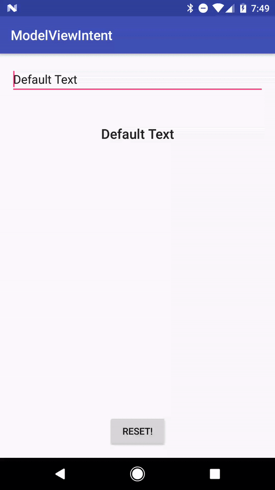

The newest cool architectural thing in Android seems to be Model-View-Intent, perhaps better known as **MVI**. I’ve read some articles about it here and there and overall it just seemed like a very strange concept. The authors of these articles kept mentioning these things called _Presenters_, which inevitably look similar to the ones we’ve become familiar with in Model-View-**Presenter**. So tonight as I decided to take a stab at MVI, doing as little as possible (because I already put in my eight hours at work today) while keeping with the spirit. Ladies and gentlemen, I _present_ to you, Model-View-Intent.

## The Sample App Overview

For this app I wanted to keep things simple and as close to a Hello World app as possible. MVI seems to be a great option when you are doing reactive programming so I figured this app may as well react to text changes.

Reacting to these text changes is made possible by RxBinding which allows us to observe on text changes and button clicks. So as the user types into the EditText field we receive the text changes which can then be processed by our Intent and passed along to our Model.

But you may be asking: how does the TextView react to those changes from the EditText? Well to be honest, it’s kind of janky, but our Model is created by passing in Consumer’s that can notify our TextView and EditText of changes to our model, and then voila, the app is working.

## Code Sample Please

Alright so now that I’ve added just enough text to match the height of my cool gif demo of the sample app I suppose I can dive into the code sample.

So first we need to take care of our **dependencies** in our gradle build file. You don’t need to add ButterKnife, but I threw it in because annotations are fun. You’ll also notice in the code examples that I am using lambdas, those are provided by [RetroLambda](https://github.com/orfjackal/retrolambda) which has a slightly more complicated setup process (though not terribly complicated) so I’m omitting it from here.

```groovy
compile "io.reactivex.rxjava2:rxjava:2.0.7"
compile "com.jakewharton.rxbinding2:rxbinding:2.0.0"
compile "com.jakewharton.rxbinding2:rxbinding-appcompat-v7:2.0.0"
compile "com.jakewharton.rxbinding2:rxbinding-design:2.0.0"
compile "com.jakewharton:butterknife:8.5.1"
annotationProcessor "com.jakewharton:butterknife-compiler:8.5.1"
```

Okay cool so now that we have our dependencies all ready to go it’s time to look at our **Intent**, and since this is Android I went ahead and named it _MainIntent._ Our _MainIntent_ takes in (spoiler alert) _MainView_ and then retrieves the available actions (which are Observables) while also creating our _MainModel_.

```java
import java.util.Map;
import io.reactivex.Observable;

class MainIntent {
    private Map<String, Observable> actions;
    private MainModel mainModel;
    MainIntent(MainView mainView) {
        actions = mainView.getActions();
        mainModel = new MainModel(mainView.getConsumers());
    }
    @SuppressWarnings("unchecked")
    void start() {
        actions.get("Button").subscribe(next -> mainModel.resetText());
        actions.get("EditText").subscribe(changedText -> mainModel.changeText(changedText.toString()));
    }
}
```

I’m still in the mindset of MVP so I included a method named _start_ which can notify the Intent that we are in-fact ready for it to start doing it’s thing. In hindsight I probably didn’t need to expose any methods, but now I nice jumping off point to dive in deep with the meat and potatoes of _MainIntent_.

```java
void start() {
    actions.get("Button").subscribe(next -> mainModel.resetText());
}
```

So as you can see we retrieve our first action which is registered as “Button”, which I subscribe to and tell _MainModel_ to reset when _onNext_ is called. If you don’t know what I mean by onNext then please [check out RxJava](https://github.com/ReactiveX/RxJava) and come back to this when you feel more comfortable with it. I also subscribe to our “EditText” action which is essentially triggered anytime the text changes, I then transform that into a String and tell _MainModel_ to changeText.

Okay cool, so next up let’s talk about that _MainModel_ I keep yammering on about. Essentially our **Model** is going to store our state while also containing default text which is used at the start of the app and whenever our awesome user’s tap the reset button.

```java 
import java.util.Map;
import io.reactivex.functions.Consumer;

class MainModel {
    private final String defaultText = "Default Text";
    private String text;
    private Map<String, Consumer> consumers;
    MainModel(Map<String, Consumer> consumers) {
        this.consumers = consumers;
        resetText();
    }
    @SuppressWarnings("unchecked")
    void changeText(String text) {
        this.text = text;
        try {
            consumers.get("TextView").accept(text);
        } catch (Exception e) {
            e.printStackTrace();
        }
    }
    @SuppressWarnings("unchecked")
    void resetText() {
        this.text = defaultText;
        try {
            consumers.get("EditText").accept(text);
        } catch (Exception e) {
            e.printStackTrace();
        }
    }
}
```

So our Intent creates our Model which requires Consumers (an RxJava thing) to be created. I couldn’t really think of a better name for these tonight, but essentially these let us communicate back to our View so as the value of _text_ changes we can update the View with the new value.

I have created two methods which are called by _MainIntent_, when resetText is called we simply update _text_ to the value of _defaultText_ and call the Consumer for EditText passing in _text_.

The other method is changeText which will notify the _MainIntent_ that it needs to update the value of _text_ and after doing so it will call the Consumer for Text passing in _text_.

For our **View** I defined an interface which can then be implemented by our Activity. Oh, and it’s called _MainView_ because again, Android.

```java
import java.util.Map;
import io.reactivex.Observable;
import io.reactivex.functions.Consumer;

interface MainView {
    Map<String, Observable> getActions();
    Map<String, Consumer> getConsumers();
}
```

It contains two method signatures, getActions which will return Observables that our Intent can subscribe to and getConsumers which will return Consumers that our Model can call to notify the view of changes.

And finally it’s time to take a look at _MainActivity_ which ends up acting as our View while also creating our Intent so we can finally get this party started.

```java
import android.os.Bundle;
import android.support.v7.app.AppCompatActivity;
import android.widget.Button;
import android.widget.EditText;
import android.widget.TextView;
import com.jakewharton.rxbinding2.view.RxView;
import com.jakewharton.rxbinding2.widget.RxTextView;
import java.util.HashMap;
import java.util.Map;
import butterknife.BindView;
import butterknife.ButterKnife;
import io.reactivex.Observable;
import io.reactivex.functions.Consumer;

public class MainActivity extends AppCompatActivity implements MainView {
    @BindView(R.id._button_) Button button;
    @BindView(R.id._editText_) EditText editText;
    @BindView(R.id._text_) TextView text;
    @Override
    protected void onCreate(Bundle savedInstanceState) {
        super.onCreate(savedInstanceState);
        setContentView(R.layout._activity_main_);
        ButterKnife._bind_(this);
        new MainIntent(this).start();
    }
    @Override
    public Map<String, Observable> getActions() {
        Map<String, Observable> actions = new HashMap<>();
        actions.put("Button", RxView._clicks_(button));
        actions.put("EditText", RxTextView._textChanges_(editText));
        return actions;
    }
    @Override
    public Map<String, Consumer> getConsumers() {
        Map<String, Consumer> consumers = new HashMap<>();
        consumers.put("TextView", RxTextView._text_(text));
        consumers.put("EditText", RxTextView._text_(editText));
        return consumers;
    }
}
```

As you can see within onCreate we instantiate _MainIntent_ while also calling start because at this point ButterKnife has bound our views and for the purpose of this sample we can safely reference them. Defined are the getActions and getConsumers which pass along the relevant Observers and Consumers. All the while our Intent knows about our View and Model, our Model knows about these Consumers it needs to update and our View knows that it has Actions and Consumers but has no idea how either are actually used.

## The End?

So that’s all I have for now. My goal with this short project was to get a better understanding of Model-View-Intent and to actually create something without also having a Presenter. It was difficult to find information to go off of so I referenced [Cycle.js](https://cycle.js.org/model-view-intent.html) for most of this.

This sample is not ready for production and in some ways it’s a little embarrassing. If I was going to actually build this out to be something easy to maintain I’d likely have the Action and Consumer key’s defined as static strings and I would also need to find a solution for typecasting to the correct objects safely. However for now I consider my goal completed and am ready for the constructive criticism.

Oh, almost forgot, here is a link to the [sample repository on GitHub](https://github.com/CodyEngel/Model-View-Intent-Android).