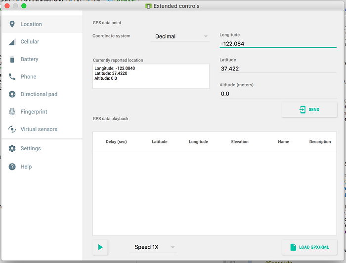
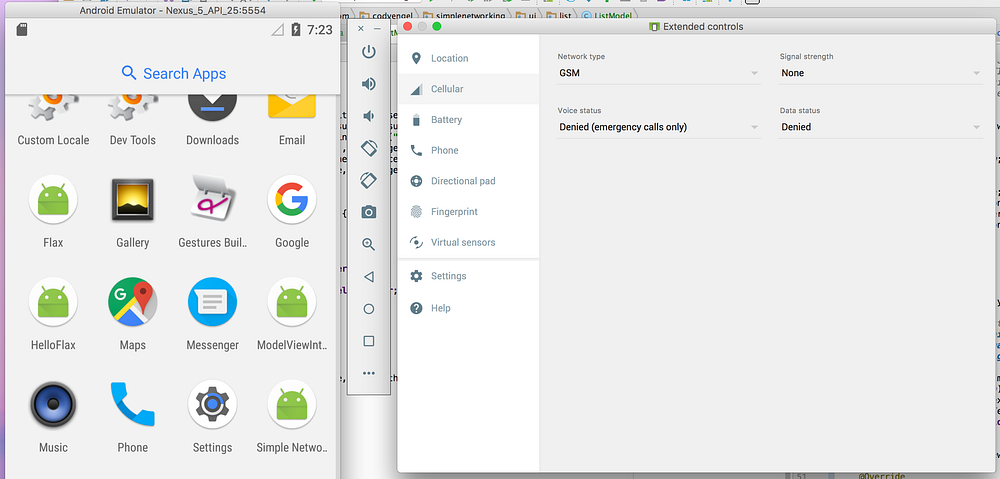
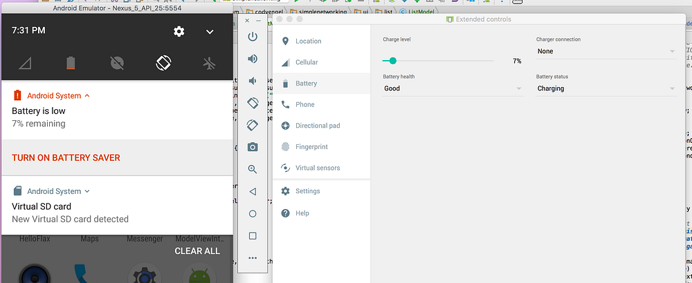
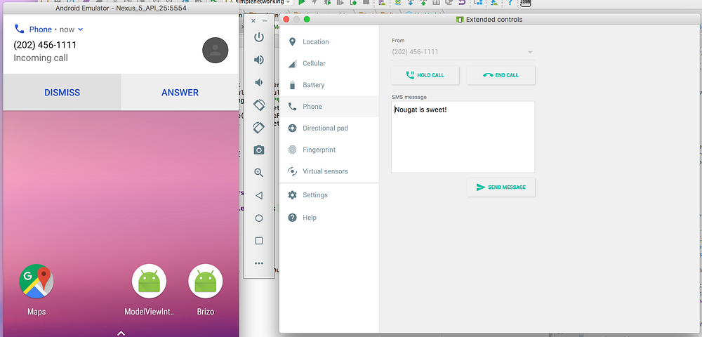
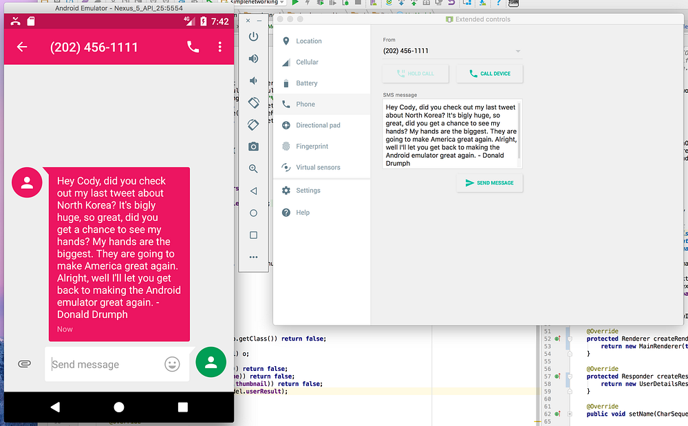
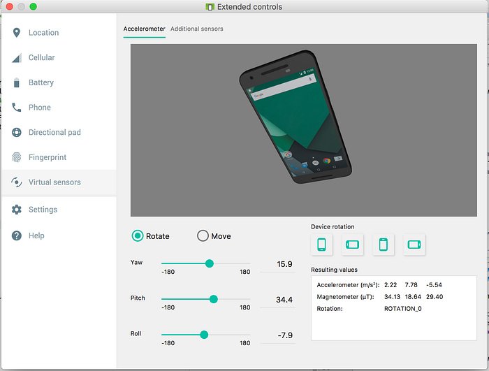
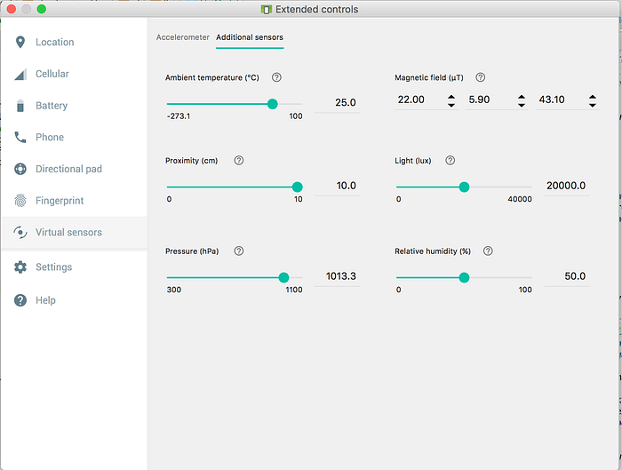
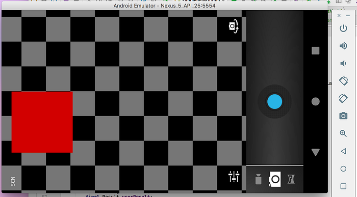

The emulator for Android has been a bit of a pain-point for the majority
of Android's existence. Back in the day it was incredibly laggy and was
really only good for cursory checks; if you were going to be a serious
Android developer then you needed a physical phone. However a lot has
changed since then, the Android emulator doesn't suck, no really, it
doesn't.

Ray Hennessy, thanks for this great picture from Unsplash.
Fun fact: this is the only picture you get when you search for
"suck".

## It Can Emulate Your Location

I once worked for a company that would pay professional drivers millions
of dollars per year to drive around with smartphones. They did this so
they could test how well the phones actually worked in the real world
while driving, this would make sense except the emulator lets you easily
emulate location data.

You can do something basic such as just setting your
[latitude and longitude](http://www.latlong.net/),
this is useful if you only need to test opening up a map and ensuring
the correct information appears. You can also load a
[GPX](https://gpxgenerator.com/)/KML if you want to
save a few dollars to test device movement. Admittedly the company was
testing a bit more than just the phone's GPS but I still enjoy telling
that story from time to time.

## It Can Emulate Your Cellular

This is probably my current favorite thing about using the emulator at
work. We *really* like to ensure that our app works well even when you
have no network connectivity. One common way people will test this on an
actual device is turning airplane mode on or off, and this works fine,
but it also requires you lose focus of the app.

Now imagine you need to notify the user that they've lost network
connectivity while in the app. Again, airplane mode works fine, but you
are essentially leaving the app in some form (going to settings or
pulling down the quick actions drawer) in order to toggle it on or off.
You may also want to do something different between having no network
connectivity and just being in airplane mode. The emulator can handle
this situation perfectly fine, the quickest way is to set "Data status"
to roaming or denied.

## It Can Emulate The Battery

This is a super useful feature and it'd be a nightmare to test with a
physical device. When you're developing for a mobile platform like
Android you *should* be conscious of the device's battery and perhaps
limit background activities or save data if the phone is getting close
to dying.

If you are only developing your app using a physical device you probably
aren't too concerned about the battery status because the idea of
testing that gives you a nightmare. Good thing the emulator doesn't suck
anymore.

## It Emulates Phone Calls and SMS

I don't think this has ever been much of a problem with the emulators, I
can't honestly remember when you *couldn't* do this. However this is my
chance to poke fun at the current U.S. administration so I figured it'd
be a good idea to talk about it.

Maybe you are building an application to do something when you receive a
phone call, or maybe you just want to test what happens when you receive
a phone call as your app is downloading a lot of data from your super
efficient API. If you didn't make use of the emulator you'd be stuck
asking your Great Aunt Sally to call you, and then you have to listen to
her yammer on and on about her cat. Admit it, this is way better than
that.

You can also send fake text messages to the emulator. There are plenty
of useful reasons to do this, however I wanted to pretend that Donald
Drumph texted me about his day.

## It Can Emulate Your Fingerprint

Most modern smartphones have a fingerprint scanner on them so it only
makes sense that the emulator could emulate your fingerprint too. This
is incredibly useful when you need to test
[RxFingerprint](https://github.com/Mauin/RxFingerprint). Shout out
to Charles Schwab for still not having fingerprint authentication on
Android even though there is a really awesome library out there for
making it easy.

## It Can Emulate Sensors

Smartphones have sensors on them. These sensors can detect everything
from movement to relative humidity, and the emulator can emulate all of
those things. Admittedly I have not had much use for this section but
it's so darn cool I feel obligated to talk about it.

The accelerometer lets you emulate device rotation as well as movement.
While it gives you fairly technical terms like yaw, pitch, and roll, the
live preview lets you see exactly what happens when those metrics are
changed. It also allows you adjust the movement of the device so you can
move it along an X and Y axis. If you've ever had to test out
accelerometer data and haven't used the emulator, you probably worked
harder than you needed to.

The emulator also provides you with additional sensors. This means you
can adjust things like ambient temperature, magnetic field, light,
relative humidity, and pressure.

## Yeah, But The Emulator Camera Doesn't Work

Back in 2015 I had the chance to visit the Microsoft campus in Redmond
to discuss issues I've had as an Android developer. After discussing
these issues I was able to see demos of everything they working on to
make my life easier. The thing that blew me away was their emulator
could use the webcam so when you opened the camera it would display
something as opposed to an emulated camera.

If you are working on an app which requires the use of the camera, you
most likely need to use a physical device for testing. This is one of
the most annoying things with the Android emulator, especially since you
can setup the emulator to use your webcam, yet it still uses the
emulated camera.

Okay so the emulator actually does use your webcam now. I'm not quite
sure when this started working, I checked tonight and was shocked to see
that it actually worked. So yes, the emulator can now use your webcam.
Good job Google.

## Boot Up An Emulator

If you haven't already, boot up an emulator and poke around, you'll be
surprised by how well it works now. Not only that but this article only
talks about the stuff you can do within the emulator settings. You can
also drag and drop files into the emulator (yes, even apks) so it's much
easier to add files for testing or installing third party apps to see
how it interacts when they are installed. Sure the emulator doesn't have
a PDF reader installed, but if you have the apk for one you can easily
install one yourself.

I really hope this article was helpful to those of you that may have
given up on the emulator. I used to hate the emulator too, but in 2017
it's a very capable tool that every Android developer should make use
of.
