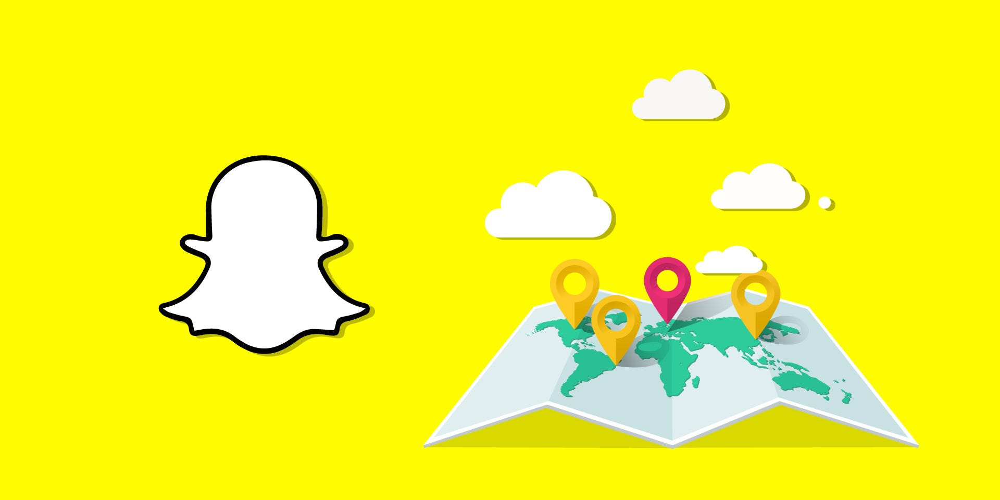
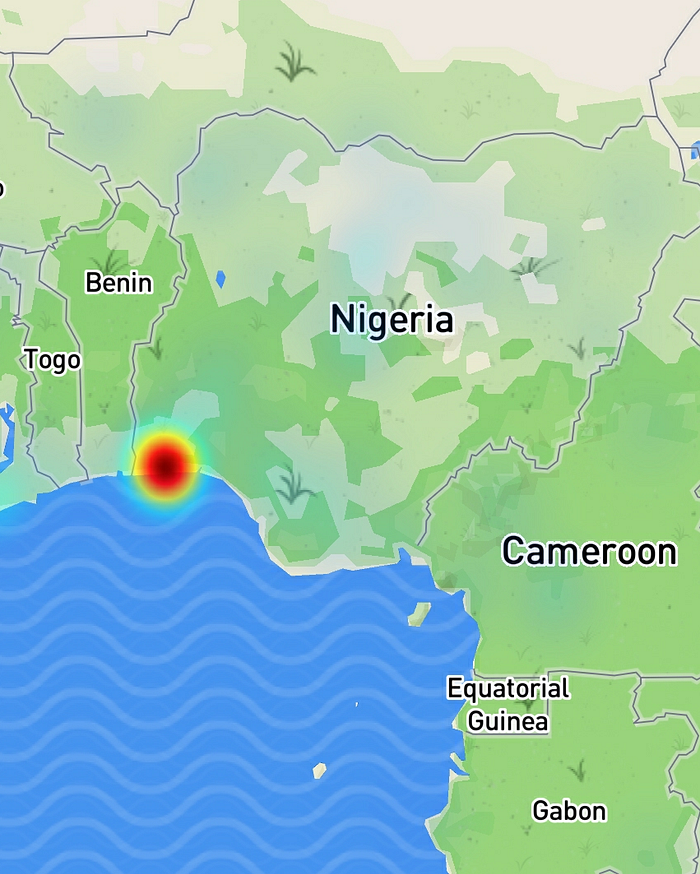

Snap Inc recently released a new feature to their popular messaging app
Snapchat. This new feature allows their users to bring up a map in the
app and see what is going on anywhere in the world. This feature is
called Snap Map, and while it is already being met with criticism, being
called [a privacy threat](https://www.theverge.com/2017/6/23/15864552/snapchat-snap-map-privacy-threat), it's actually a pretty big deal.

I first started using Snap Map late last week. To my surprise the team
at Snap Inc decided to send out a tutorial snap explaining how to use
the new feature. When I first began using it it seemed very similar to
their Discovery feature, which essentially lets you see curated stories
from stuff going on around you. Actually, it seems like the stories
you'd normally see in the Discovery area have now been moved onto to the
map and out of the list.

However after I got my bearings I soon realized that I could pan around
the map and instead of being able to view stories local to me I could
view stories at events happening in a completely different country. In
the past I could occasionally view certain stories but it was usually
reserved for major events or protests.

[Snap Map](https://www.youtube.com/watch?v=bvl82FfnUvw)
could have ended there and it would have been a welcome addition to
Snapchat. They took it one step further though by adding a heatmap
overlay on the map. This allows you to see areas on the map with a lot
of stories, if you are interested in seeing what is going on simply tap
on that spot on the map and it will load the snaps. Last night I watched
someone in northern Canada splitting wood and watching some guys in
India goofing around and dancing. This is what makes this feature killer
and why it's a big deal.

## Snap Map Is The New News Feed

Social networks have been around since the internet was a niche product.
They started out as online bulletin boards which then evolved into chat
rooms. The chat room evolved into Friendster which turned into MySpace
which was consumed by Facebook. Along the way as technology advanced the
medium for sharing changed. In the beginning you could only share text,
which then evolved into images, and today you are able to go live on
Facebook and possibly witness a clown murderer.

Facebook does a great job letting you share images and silly political
rhetoric with your friends. The things you post on Facebook tend to be
less candid and a bit more serious. Compare that to Snapchat which takes
a less serious tone, unsurprisingly the app that was created to share
nudie pics attracted more silly and candid behavior. Facebook is like a
photo album, you only want to share the good parts because that's how
you want to be remembered. Snapchat has no concept of history, it lets
you live in the moment and so it's more akin to what happens in between
each picture you share on Facebook.

Remember how I mentioned I was able to watch some person in northern
Canada splitting wood? That was the moment I realized that this feature
was a game changer. I am very much a progressive Bernie Bro, and I tend
to surround myself with people that are similar to me. This gives me a
completely distorted view on reality. The same can be said for a die
hard Trumpette. Neither of us really understands the other one, but now
with Snap Map we sort of can.

If Snap Map can gain traction I think it's going to make the world that
much smaller. Now if I want to see what is going on in Mongolia I can
simply open the map, tap on Mongolia, and suddenly I can see what people
are up to. Likewise if I want to know what is going on in Alabama or
North Carolina I can do that too. This is the new news feed.

## It Finally Offers Discoverability

The major pain point of Snapchat was how difficult it was to discover
interesting people to follow on the platform. They made it slightly
easier with Snap Codes but it still required you to know about that
person from a different platform such as YouTube, Instagram, or Twitter.
While it doesn't currently seem possible, Snap Map could easily extend
the ability to follow users and see their public Snaps in your stories
timeline.

So why is this a big deal? Well right now Snapchat doesn't generate a
ton of revenue. Well, it's reported that [they could reach $1 billion in revenue in 2017](https://techcrunch.com/2016/09/06/report-snapchat-ad-revenues-to-reach-almost-1-billion-in-2017/), so they do generate revenue,
just not as much as their competition. However if they are able to give
creators a legitimate way to build a following and can build in a
partner program similar to YouTube, they could grow their revenue and
users by a lot (yes, I know, very scientific).

So Snap Map is a really cool feature. If you haven't used it yet, open
the app, pinch the camera (like you are zooming out), and you should see
it expand out to a map. From there swipe around and explore the world,
it's realer than Facebook and for some people it might be as real as it
gets. With any luck Snap Map will be the next News Feed and bring the
world closer together.

Thanks for taking the time to read my article. If you enjoyed it feel
free to share this with friends and family!

_This article was also featured on [Business Insider](https://www.businessinsider.com/why-snap-map-snapchats-new-feature-is-going-to-be-big-2017-7?r=US&IR=T)_
