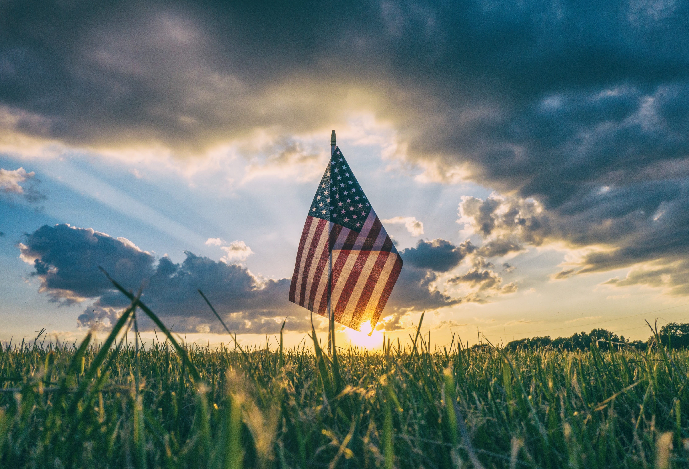
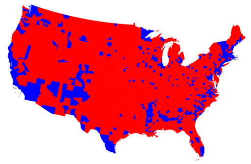
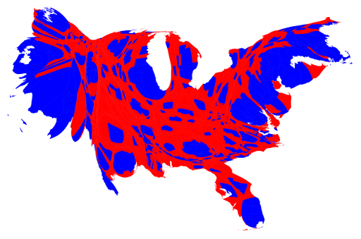
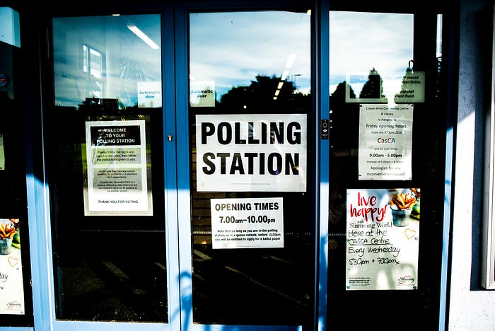
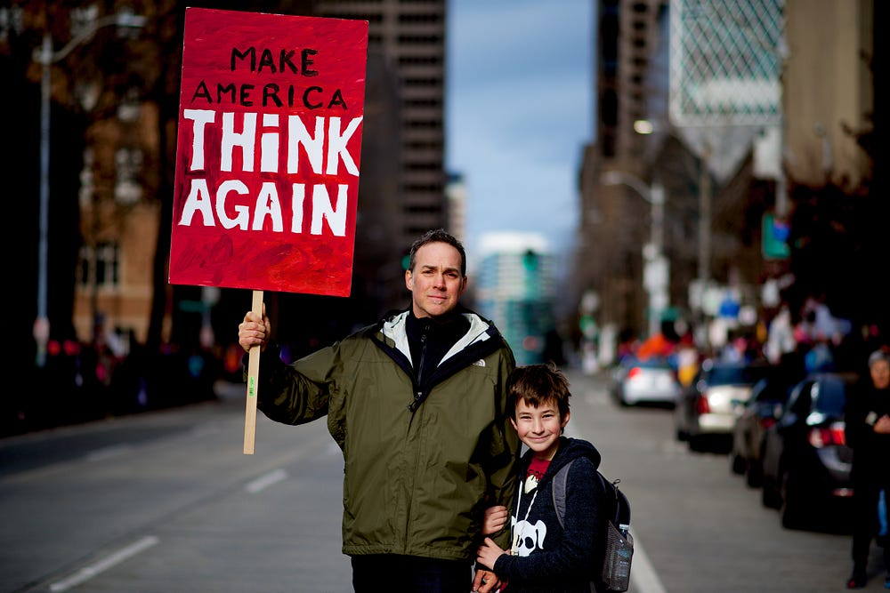
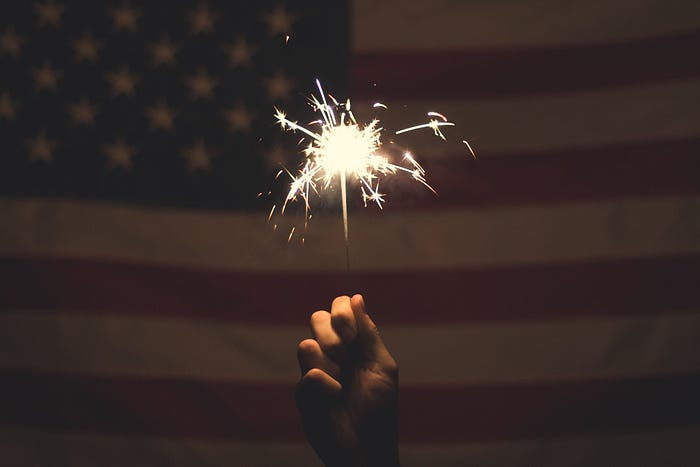
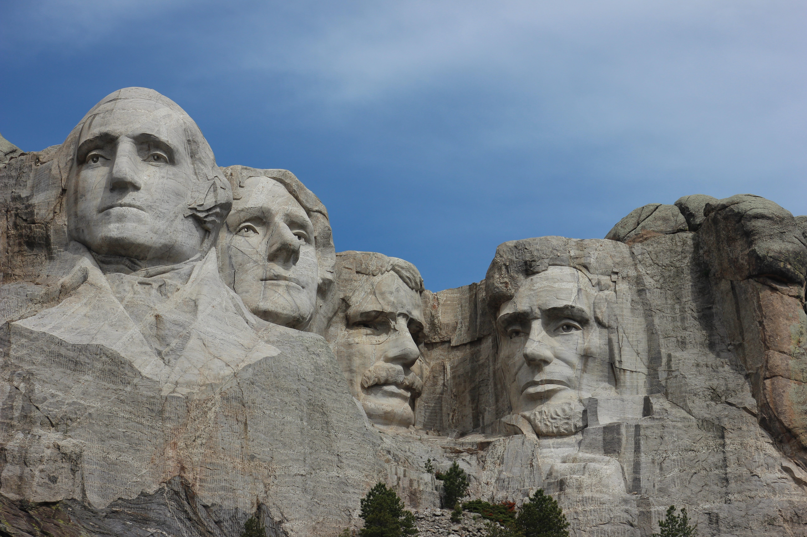

Let me be very clear, President Donald Trump is our president and there
was approximately no chance for Hillary Clinton to defeat him. While I'm
very vocal in my dislike for President Trump, I also think it's very
important to recognize that he found a base which could relate to his
rhetoric. While I voted for Hillary, it wasn't because I genuinely
agreed with her, it was because she was the lesser of two evils in my
eyes, and when that's your only reason to vote for someone, they
probably won't win.

Now that I've gotten that out of the way I'd like to discuss why voting
in the United States is broken.

## The Electoral College

The Electoral College was created to protect citizens from being
manipulated by a tyrannical dictator. When an American casts their vote
on election day they aren't voting for the president but are instead
telling their representative within The Electoral College that they
would appreciate it if they voted for that candidate.

> The result of this system is that in this election the state of
> Wyoming cast about 210,000 votes, and thus each elector represented
> 70,000 votes, while in California approximately 9,700,000 votes were
> cast for 54 votes, thus representing 179,000 votes per electorate.
>
> Source: [http://www.historycentral.com/elections/Electoralcollgewhy.html](http://www.historycentral.com/elections/Electoralcollgewhy.html)

That is an incredibly depressing statistic. Smaller states have a
drastically larger impact on the outcome of an election than larger
states. If you are a republican in California then why bother with
voting? California is clearly a blue state, and considering one
electoral college vote requires 100,000 more like minded people to win
than would be required in Wyoming it's also more unfair.

> If the president were elected by unfiltered national vote, small and
> rural states would become irrelevant, and campaigns would spend their
> time in large, populous districts.
>
> Source: [http://dailysignal.com/2016/11/07/why-the-founders-created-the-electoral-college/](http://dailysignal.com/2016/11/07/why-the-founders-created-the-electoral-college/)

This is almost entirely pointless in today's world. During the election
cycle candidates are plastered all over social media and news outlets.
While it's great for a candidate to travel to the different parts of the
country I don't think it makes sense to handicap the more popular areas
of the country. The Electoral College in today's age is giving more
power to conservative voters (mostly occupying lower population density
centers) while taking away power from liberal voters (mostly occupying
higher population density centers). I'd like to dive a little deeper
into that, let's take a look at two images.

These images are representing the same data, which is which party won
each county. The first image keeps the map of the United States
untouched and it is often used by supporters of President Trump. The
second image skews the map to better represent population, as you can
see Chicago and Milwaukee become much larger, as does New York City.

I want to live in a world where every person is treated equally in the
political system. The Electoral College completely fails at doing that
given a voter in one state has a vote of 1/70,000 while a voter in
another state only has a vote for 1/179,000. Votes should be treated
equally, it's 2017, politicians don't need to travel to every nook and
cranny to give a speech these days.

So what's the "simple" solution to removing The Electoral College? I can
see a few options, the first being a simple popular vote, the candidate
with the most votes wins. This would be the simplest method and I think
it would encourage everyone to get out and vote. It may also encourage
people to vote third party.

Another option is to allow for representatives to be added to congress,
currently the number is set to 435 and every state is guaranteed 3
representatives. As of this writing there are
[326,231,734](http://www.worldometers.info/world-population/us-population/)
people living in the United States. That means each member of congress
has represents on average 749,958 residents, it's no wonder why these
people have such [abysmal approval ratings](http://www.gallup.com/poll/203606/congress-job-approval-jumps-highest-2009.aspx). So another solution is to just add more members of
congress, everyone state would be guaranteed a certain number of
representatives, but larger states wouldn't be penalized as much as they
currently are either.

Neither of those solutions is perfect. I feel like the second solution
ends up highlighting further issues with the political system in the
United States. However the first step to fixing something that is broken
is to acknowledge that it is in-fact broken.

## Voting On Tuesday

If we can't all agree that The Electoral College needs to be removed or
revamped we can at least all agree that voting on Tuesday is stupid,
right? So, [why Tuesday](http://www.whytuesday.org/answer/)?

If you are unable to watch that video allow me summarize why we vote on
Tuesday. In 1845 people traveled by horse and buggy and it could take a
day or longer to get to your polling place. Sunday was still a day of
rest so Monday was out of the question which is why it falls on a
Tuesday.

> They don't want you to vote. If they did, we wouldn't vote on a
> Tuesday. In November. You ever throw a party on a Tuesday? No, because
> nobody would show up. — Chris Rock

Of course the day of the week isn't in itself a bad thing. The issue
with voting on Tuesday is that many Americans have to work between 9am
and 5pm on Tuesday. Polling places tend to be reported as overcrowded
(though it has never taken me longer than an hour to cast my vote) and
so even if your workplace is flexible you still may be swayed not to
vote because of the uncertainty for how long it may take. So regardless
of what day in the week Election Day falls on, it should be considered a
national holiday and businesses operating in the United States should be
required to be closed on that day.

I'm not quite done complaining about the day of the week though. The
majority of countries hold their elections on the weekend, and the
majority of that majority
[hold their elections on Sunday](https://en.wikipedia.org/wiki/Election_day#Sunday). I understand that Sunday is the day of worship for many, but
for most people that worship on Sunday likely only spend an hour or two
there. So we should ditch Tuesday and start voting for our elected
officials on Sunday.

Oh wait, I suppose I forgot a very important part about why voting on
Tuesday sucks, it seems like I gave a solution to a problem that I never
actually defined (although I think it's mostly obvious). Voter turnout
in the United States is laughable at best and could be better described
as pathetic.

According to a [recent study by Pew Research](http://www.pewresearch.org/fact-tank/2017/05/15/u-s-voter-turnout-trails-most-developed-countries/), voter turnout was 55.7% which put us in the bottom 8
(not country Turkey because they had no data) of the study. Of residents
old enough to vote, 86.8% have registered which means roughly 30% of
registered voters decided not to vote. Making it easier to vote by
making the day we vote more accessible would be a step in the right
direction. Other countries have [compulsory voting laws](https://qz.com/746737/there-is-a-way-democracies-can-create-better-informed-voters-but-youre-not-going-to-like-it/), Australia for example will fine non-voting citizens
$15. Honestly, this isn't a terrible idea, use the money collected to
raise awareness of Election Day in the future.

Alright so voter turnout sucks and I'm mostly *blaming* Tuesday for
that. Believe it or not, there are still other reasons why voting in the
great United States of America is broken though.

## The Democratic Primary & Superdelegates

One thing I learned during the 2016 election season is the Republican's
have a far better primary process than the Democrats. You've probably
realized by now that I am more liberal than conservative, so this hits
pretty close to home.

My main issue with the Democratic Primary are the superdelegates. As
mentioned previously, I'm a major fan of all votes being equal,
superdelegates completely ignore that idea. The *normal* people are all
worth a very small fraction of a single delegate while members of the
DNC (Democratic National Committee) and elected officials that identify
as democrats are each worth a single delegate. That's stupid and it
leads to a very broken system.

Why is it broken? Before the very first primary news outlets were
reporting about pledged delegates which made a certain candidate look
more qualified than the others and so voters were already being
influenced before they even heard the first debate between candidates.

If you are going to have a primary to decide who should be the
frontrunner with the best odds of winning an election, then let the
people decide. All superdelegates are is another version of the
electoral college, which as we discussed earlier that is also broken.

## Caucuses Are Ineffective

If you are like me and live in a state that doesn't have a caucus you
might be wondering what the heck one actually is. Essentially people
meet at a predetermined time and place to choose their preferred
nominee. In a world where you can
[order pizza from your sneakers](https://www.youtube.com/watch?v=IyQeSdNNuKM), caucuses are incredibly dated.

In a study from 2014 it was found that [26.6% of Americans work at night](http://www.slate.com/blogs/moneybox/2014/09/11/u_s_work_life_balance_americans_are_more_likely_to_work_nights_and_weekends.html), and the definition of "night" was between
10pm and 6am. If you expand the number out to Americans that don't work
9–5 (the ones that wouldn't fit into a caucuses schedule) that number
would almost certainly be larger. I feel it's safe to say that caucuses
are not pro-working class and instead are a way of systematically
removing the voices of the work class.

Even for those of us that can make it to a caucus are not safe though.
The majority of us are not professional politicians, while voting is a
right it is also a pain in the neck. So requesting that people gather in
a room for a few hours to cast a vote for their preferred nominee is
almost a non-starter. Sure you'll get the die hard fans for candidates
but you won't attract the regular voters that will turn out on election
day.

I have absolutely no idea why caucuses still exist in 2017, if you know
why feel free to leave a response, I'd love to get other opinions.

## Voter Suppression Happens

I'm all for avoiding voter fraud, however I've yet to see any real
evidence of fraudulent votes being cast. Sure there are a few outliers
where someone ends up registered to vote in two states (I'd assume by
mistake), but that doesn't really swing elections. Voter suppression
does happen though, and it's consequences are far worse.

Let's take a [look at Florida as an example](http://articles.orlandosentinel.com/2011-05-05/news/os-elections-bill-passes-20110505_1_early-voting-league-of-women-voters-statewide-voter-database). In 2011 a bill was passed which cut the early voting
days from 14 to 8. It removed the ability to change your address at the
poll. It enacted regulations around registration groups like the League
of Women Voters, to turn in voter-registration cards within 48 hours or
face fines, something which may not be possible if registering thousands
of people in a short time.

Photo ID laws, which request your present some form of identification
with your photo on it, seem like a good idea until you dig a bit deeper.
In Texas for instance, [1 million of their 13.5 million registered voters lack a photo ID](https://web.archive.org/web/20100115215953/http://www.dallasnews.com/sharedcontent/dws/news/texassouthwest/stories/DN-voterid_11tex.ART0.State.Edition2.4ac6919.html). While a photo
ID is important for purchasing liquor, driving, as well as flying; it's
also not necessary for everyone. All this does is make it harder for
people to vote and in some cases requires them to obtain another form of
identification they otherwise wouldn't need.

Previous felons may also be denied the right to vote. Again this may
sound like a well meaning idea, but considering our criminal justice
system is supposed to rehabilitate criminals into being productive
members of society, it makes no sense to remove their right to vote. In
2004, 5.3 million Americans were denied the right to vote for this very
reason.

## Election Day Is Underfunded

This topic could have fit in with voter suppression however I felt it
might make more sense to dive into further detail. Elections in the
United States typically aren't funded equally, Wyoming spent $2.15 per
voter in 2004 while California spent $3.99 per voter. Canada on the
other hand spends $9.51 per voter.

One complaint voters have on election day is how long it takes to cast
their ballot. In a better funded area this may not be much of a problem,
if at all. This is great if you live in an area that can afford to spend
more on their voters, however if you are in an area with less resources
you may find yourself waiting in longer lines because there just aren't
enough people to run the polling facility.

## Not Enough Publicity

America really only cares about elections every 4 years despite having
major elections every 2. When we are voting for the president we'll show
up en masse (well, kind of), but when it comes time to voting in the off
year elections we rarely make much of a fuss. This again goes back to
voter suppression, you can't vote if you don't know you are supposed to
vote.

Voting in the United States is broken. I hope this article sheds some
light on areas of our voting process that could be made better and I'm
interested to hear about how you feel about how voting works in the
United States.

If you enjoyed this article be sure to recommend this article (click the
heart icon) and follow me on Twitter to know when I post new articles.