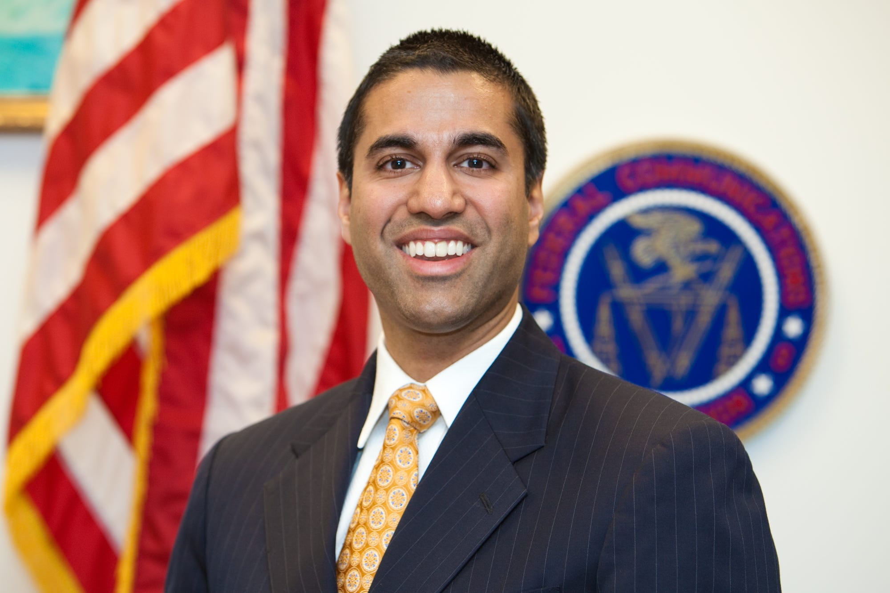
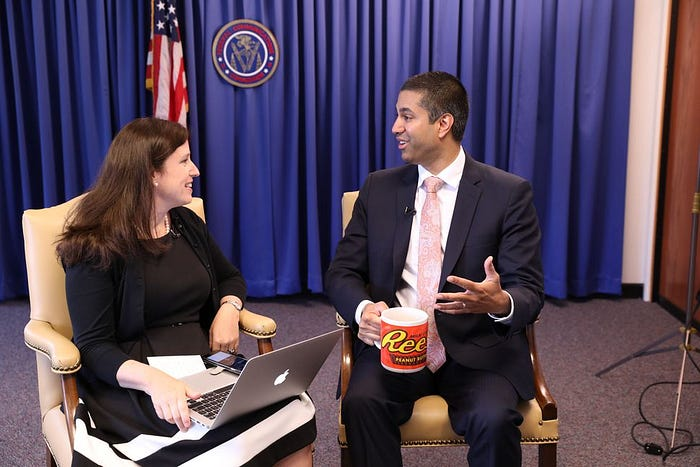

I was excited for this week. I took today off, and the office is closed Thursday and Friday for Thanksgiving; hello five day weekend. Unfortunately [Ajit Pai decided to ignore 98.5% of respondants](https://arstechnica.com/tech-policy/2017/08/isp-funded-study-finds-huge-support-for-keeping-current-net-neutrality-rules/) that wanted the ISPs to remain classified under Title II, and mid-December the internet will likely drop back down to Title I classification. There is however an [investigation that Ajit Pai is currently obstructing into falsified comments around Net Neutrality](https://arstechnica.com/tech-policy/2017/11/fcc-stonewalled-investigation-of-net-neutrality-comment-fraud-ny-ag-says/). This isn't an article to go over the differences, or even dive too deep into why I think this is a bad idea. If you are reading this we already agree that destroying Net Neutrality is a bad idea.

It'd be easy to point the finger at Ajit Pai, the person that is ignoring the public's comments and is siding with the 1.5% that was for destroying Net Neutrality. I don't blame Ajit though. I never expected this person to do the right thing. Someone that will [stonewall an investigation around falsified comments to mislead the American people](https://arstechnica.com/tech-policy/2017/11/fcc-stonewalled-investigation-of-net-neutrality-comment-fraud-ny-ag-says/) was probably never concerned about our own interests.

I was deeply disappointed when I found out about the vote that occurred in October to reinstate Ajit Pai for four more years as Chairman of the FCC. Democrats in the Senate worked together to bring this to the floor for open discussion. However to my surprise there were some democrats that decided to vote to keep Ajit Pai. Others decided to simply abstain and not vote.

## Who Voted To Keep Ajit Pai?

It was mostly split between party lines. Republicans either abstained or voted Yay (in favor) for Ajit. However there were [some Democrats that also showed up in the Yay roll call](https://www.senate.gov/legislative/LIS/roll_call_lists/roll_call_vote_cfm.cfm?congress=115&session=1&vote=00209#position) along with a few that chose to abstain from this incredibly important vote to save Net Neutrality.

The following Democrats voted to destroy Net Neutrality:

**[Gary Peters of Michigan](https://www.peters.senate.gov) voted to dismantle Net Neutrality**

Hart Senate Office Building\
Suite 724\
Washington, DC 20510\
Phone: **(202) 224–6221**

**[Jon Tester of Montana](https://www.tester.senate.gov) voted to dismantle Net Neutrality**

311 Hart Senate Office Building\
Washington, DC 20510–2604\
Phone: **(202) 224–2644**\
Fax: (202) 224–8594

**[Joe Manchin of West Virginia](https://www.manchin.senate.gov) voted to dismantle Net Neutrality**

306 Hart Senate Office Building\
Washington D.C. 20510\
Phone: **(202) 224–3954**\
Fax: 202–228–0002

**[Claire McCaskill of Missouri](https://www.mccaskill.senate.gov) voted to dismantle Net Neutrality**

503 Hart Senate Office Building\
Washington, D.C. 20510\
Phone: **(202) 224–6154**\
Fax: (202) 228–6326

The following Democrats and 2016 Presidential Hopeful abstained:

**[Bob Menendez of New Jersey](https://www.menendez.senate.gov) didn't show up to save Net Neutrality**

528 Hart Senate Office Building\
Washington, D.C. 20510\
Phone: **(202) 224-4744**\
Fax: (202) 228-2197

**[Catherine Cortez Masto of Nevada](https://www.cortezmasto.senate.gov) didn't show up to save Net Neutrality**

204 Russell Senate Office Building\
Washington, DC 20510\
Phone: **(202) 224–3542**

**[Bernie Sanders of Vermont](https://www.sanders.senate.gov) didn't show up to save Net Neutrality**

332 Dirksen Building\
Washington, D.C. 20510\
Phone: **(202) 224–5141**\
Fax: (202) 228–0776

## Help Save The Internet!

Just because there will be a vote to repeal the Title II classification doesn't mean there isn't something we can still do. I strongly recommend visiting [Save the Internet](https://www.savetheinternet.com/sti-home) to find out more information about what you can do. Also feel free to contact the above Senators to voice your opinion on their voting decision. If this article resonated with you, feel free to share it with friends and family.