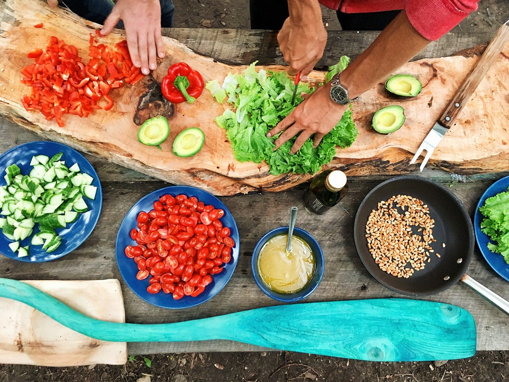
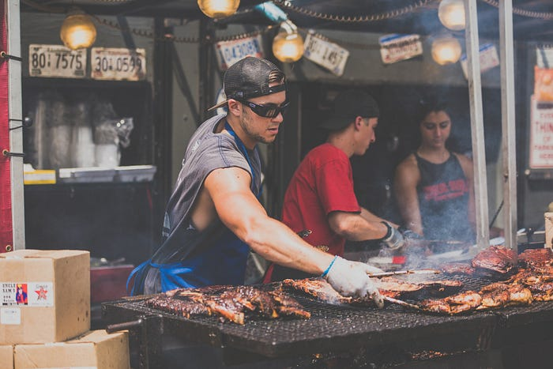

I've been fortunate enough to teach new employees at Yello about what our engineering department is about. As I prepare for my next session, I wanted to focus on really explaining what Agile is, how Scrum fits into that philosophy, and how the squads (teams) play into that. Being the analytical person I am, I started off with a bunch of bullet points which Nick Cruz promptly dismissed as too dry and too much like a lecture. We started brainstorming metaphors, Nick mentioned cooking and I was off to the races.

## Agile is Cooking

Agile is a lot like cooking, no really, it is. Cooking by definition is *the practice or skill of preparing food by combining, mixing, and heating ingredients*. It has a few guidelines that you need to follow which includes taking some ingredients, combining or mixing them together, and adding some heat to them. If you follow these guidelines at the end you'll have food which has been cooked; it might taste good or might be disgusting.

Just like cooking, if you want to practice agile you have to follow some general guidelines. Individual interactions over process and tools. Working software over comprehensive documentation. Customer collaboration over contract negotiation. Responding to change over following a plan. If you further want to follow the agile, you should [follow the principles behind the manifesto](http://agilemanifesto.org/principles.html).

Software delivery can be thought of as a step above cooking, it's essentially the idea of food preparation. Sure you can cook food as a way to prepare it, but I can also just pull some cold cuts out of the fridge and make a sandwich, that's not cooking that's just preparing lunch. We choose agile over waterfall because we like the outcome, the same is true why we decide to cook instead of just make a sandwich.

Again, just because we follow agile doesn't mean that the result will be amazing software. Sometimes you can get lucky with the ingredients and preparation being perfect, and the outcome will be world class software. However for most people you need some extra help, you need a recipe.

## Scrum is a Recipe

If you want to make spaghetti for dinner chances are you'll boil some noodles for 10 minutes, heating up red sauce during that time. Once the noodles are ready you'll combine the sauce and noodles and the outcome is decent spaghetti. This recipe includes ingredients, steps, and some prescribed outcomes from those steps.

The ingredients of Scrum are the team itself which include the Product Owner, Development Team, and Scrum Master. The steps are defined as scrum events which include Sprint Planning, The Sprint, Daily Scrum, Sprint Review, and Sprint Retrospective. Providing you have the correct ingredients and follow those steps you should have some outcomes known as scrum artifacts which include: Product Backlog, Sprint Backlog, and the Increment (deliverable software).

Like any good recipe there is room to make adjustments as you see fit. However it's always best to start with the proper recipe and determine if you need to add or adjust certain things. It's best to discuss these things within the Sprint Retrospective where you often have action items to work on during the following Sprint.

## The Team is a Restaurant

While I'm not a major fan of deep dish pizza, when the mood strikes me (as it did last night) I turn to [Lou Malnatis](https://www.loumalnatis.com). This may seem obvious to some people from Chicago, for the rest just understand they have decent deep dish. On the other hand, if I wanted a greasy and salty burger I would have ended up at McDonalds. Every team should specialize in some aspect of the business. In a small company their focus may be larger in scope while larger businesses should have their teams focus on smaller parts of the business.

Teams in a healthy agile setting are just like a restaurant. They understand what they are going to deliver. As they continue to grow, the menu they offer will change and the various dishes will see their recipe changed. This is important for the restaurant to stay competitive, if they aren't always getting better then they will stagnate and eventually be replaced. Teams in an agile setting should encourage and embrace change, through scrum these changes are usually agreed on within retrospective.

Further, since teams are focused on a specific area it is easier for them estimate how longer it will take to deliver something. Imagine ordering a deep dish pizza from McDonalds; if they had the right tools they could probably deliver something to you however it will probably take a while and most likely won't come out as good as Lou's pizza. Software is the same way, a team of web developers can deliver a native Android and iOS app however it will likely take a bit longer and probably won't be quite as good as a team that is focused on mobile.

## Software is Like Food

There are many ways you can make the food and there are certain philosophies that are known to work better than others. If you want to hit the ground running it's best to follow a recipe and make small adjustments as you go. Keep in mind that in order to get the best food you'll want a restaurant that is focused on delivering that specific type of food.

Thanks for reading. If you enjoyed this article (or are now hungry like I am), feel free to share it with friends, family, or colleagues.