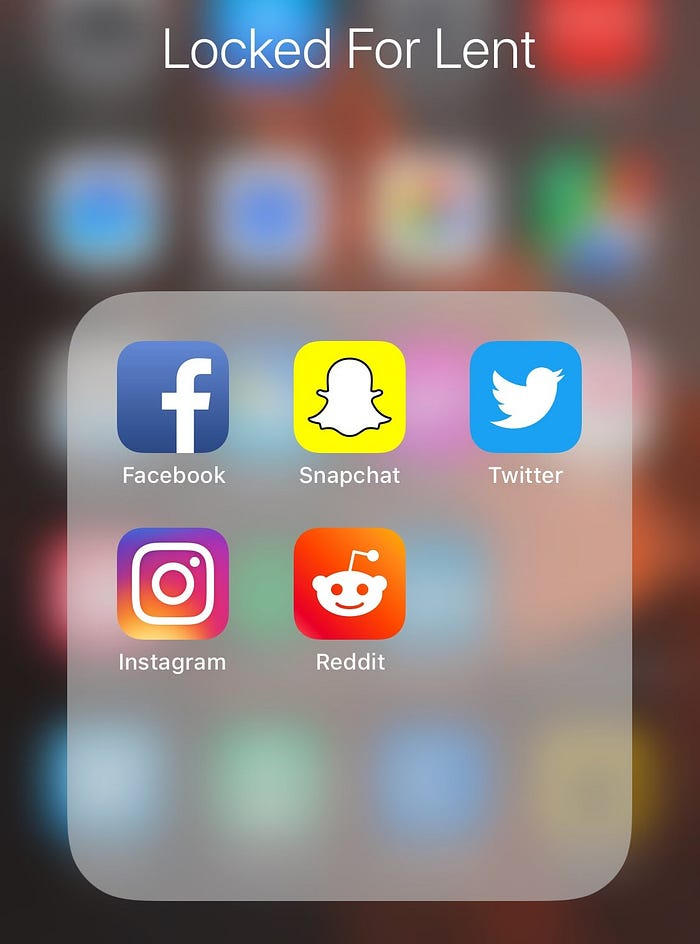

I have spent the majority of my life online. If I had to figure out where I first started sharing my ideas online it would probably be on the [\[adult swim\] message boards](http://www.adultswim.com/misc/boards/) when I was a teenager. I spent the majority of my time discussing topics in their general board known as *Babbling*. This was also the first time I experienced the gamification of sharing online as the more posts and time you spent on their message boards the higher your rank would be. These ranks came in the form of a title others could see under your name as well as your username showing up in a different color. As time went on I started focusing my attention on *Incoherent Babbling* which was for more random discussions and really helped boost your post count. It has been more than a decade since I last logged in but I feel like that gamification to share things has stuck with me.

I moved onto MySpace when I was in high school, however eventually I switched to using Facebook. In college I started using Twitter and was excited to use Instagram when it was first launched for Android. I have tried to give up Facebook a number of times in the past through deactivating my account but I quickly learned that my social logins on other websites made that incredibly difficult. However I was determined to actually give up social media for an entire month (using Lent as an excuse), and I'm proud to say that I was *mostly* successful in doing so; this is how I did it and what I learned.

## Goodbye Social Media

I started the process by figuring out why I wanted to give up social media in the first place. It all came down to the amount of time I wasted everyday scrolling through feeds and the unhappiness it usually brought. This is how I came up with what it actually meant to give up social media and if I slipped up (which happened) I could determine whether or not I failed at what I set out to do.

With this in mind, I had to keep Facebook installed on my phone as it is how I log into other websites and apps; I also use Facebook Messenger for group chats and talking with some of my past co-workers. Instead I opened the settings app on my iPhone and disabled all push notifications. I did the same for Twitter, Instagram, and Snapchat. I then moved those apps into a folder titled "Locked For Lent" and moved it to the very last screen on my phone. This essentially made the apps invisible to me and I was actually surprised how effective this was.

Had I not started with a clear goal in mind I may have blindly uninstalled all the apps instead of determining the root problem which were the notifications and being on my home screen.

## Hello Social Life

This is the part where I say my social life really took off and I was able to make a lot of new friends and experienced a ton of success. As an introvert none of that actually happened, the title just seemed to make sense. What I really want to do is explain what I learned from all of this.

I noticed that started to appreciate the moment I was living in a bit more. No longer was I taking pictures that would self-destruct in 24 hours, if a moment was worth remembering I took out my phone and snapped a picture or recorded a short video. I was now focused on living in the moment instead of trying to make my life seem like it was more exciting than it actually was.

In the evening I spent time being bored. Without Instagram or Facebook to serve as a distraction I had to actually figure out what I wanted to do with my time. As a side note: I also gave up Reddit for part of this period which was about as rough as you'd think it would be. During the past month I watched movies some nights while others I zoned out and played video games. I went from one vice to another vice, but at least the new vices let me unplug from the world and relax.

This past month also made me realize how much Facebook rules my social life. I wasn't able to check the events that were going on and thus invitations I received from friends went unchecked and there was one less person to RSVP as *maybe* for a couple of events. Another interesting thing happened: I could no longer write a post about a restaurant I went to or ask a question to all of my friends. I couldn't share experiences on Snapchat or Instagram either; I was forced to message my friends and actually talk to them. I started checking in on Facebook Messenger more and had actual conversations a bit more often. It was actually really refreshing.

Another thing I learned was that people around me are addicted to these feeds. I live with my girlfriend and I was surprised how much time she spent scrolling through Facebook watching cooking videos from Tasty. In the past I never realized this since I was also usually checked out, scrolling through some social feed on my phone. Perhaps the most important thing I learned from all of this is that these apps affect those around us; when you are looking at your phone it's harder to be present in the moment.

The final thing I learned was that I did not go insane. At the start of this journey I thought it would be really difficult to give up social media. I had a feeling that I would cave halfway through, but to my surprise I was able to stay away from these apps throughout Lent. I had a number of unchecked notifications the morning of Easter, too many Snapchat messages to sift through, and quite a bit of catching up to do on Instagram.

## Okay, I accepted a few friend requests this month…

At the start of this article I mentioned that I slipped up a few times however I did not fail at achieving my actual goal. There were a few times this month where I scrolled to my *Locked for Lent* folder and opened Facebook. I was in the process of finding a new job and so co-workers from my (now previous) company were sending me friend requests. I logged in a few times to accept the friend requests but I did not scroll through the feed or check my notifications.

I also slipped up once with Snapchat. I found myself at a really neat and unique speakeasy downtown and they had an awesome jazz band playing. So I took out my phone, opened Snapchat and posted a few videos to my story. I did not check anything else on Snapchat and was still able to live in the moment with my friends.

## Give up social media for one month.

This is the part of the article where I wrap things up and provide a call to action. I have since renamed my *Locked for Lent* folder to *Time Wasters*, and they continue to live on the last screen on my iPhone and the notifications are still turned off. I check in periodically throughout the day, which I attribute mostly to my friend Nick Cruz starting a new job in San Francisco and I'm just really curious if they are giving him a propeller hat. I have found that the habits I learned over the last month are starting to stick (I'm reading more and playing video games when I need to unwind).

So now it's your turn. If you are reading this article you are probably ready to take a break from social media, so do it. Move the apps to a folder and call it *Locked For 30 Days*. Then disable all notifications you receive from those apps, and make sure the folder is on a screen that is at least a few swipes away. Fill your home screen with apps that are actually useful for you. Maybe put a news app or a reading app front and center, this way when you do get the itch to kill some time you are spending that time being at least somewhat productive.

The last thing I want you to do is to set a calendar reminder for 30 days from now. Reflect on how the experience changed your habits. If this resonated with you, feel free to share it with friends or family.