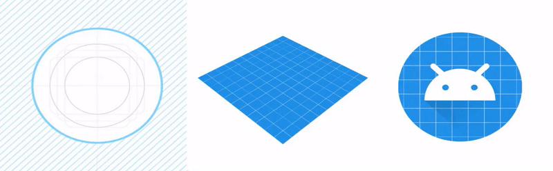
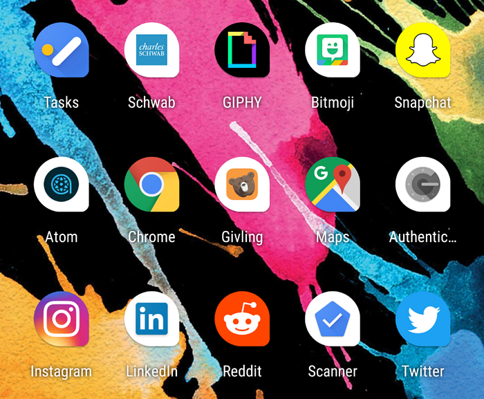
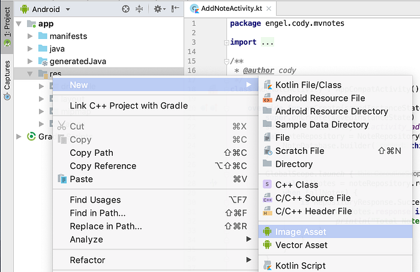
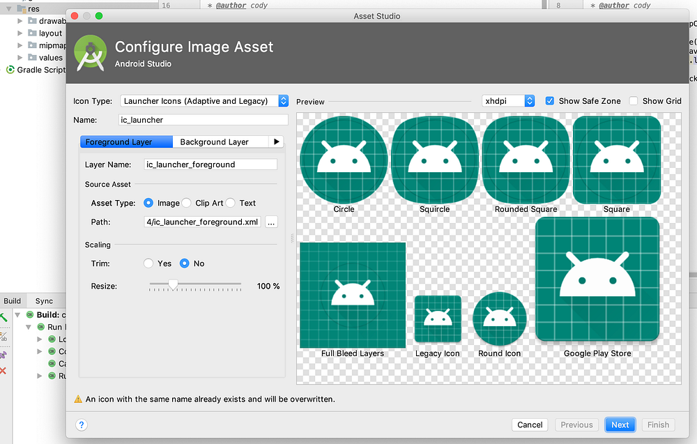
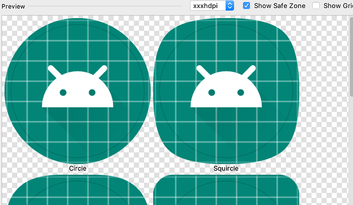
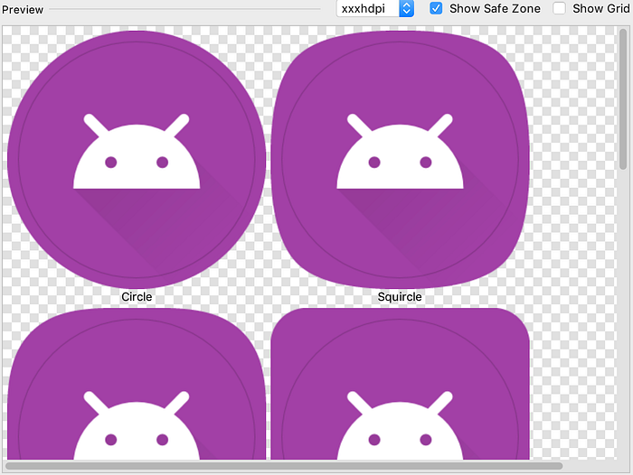

Adaptive icons on Android were introduced in Android Oreo, however I've found numerous applications today still aren't using them. In fact, one of the applications I work on today still uses the old legacy icon. On a new application my company is planning to release *soon* we decided to try out adaptive icons and to my surprise it was ridiculously easy so I wanted to provide a quick tutorial on how you can adapt to adaptive icons yourself.

## What Are Adaptive Icons?

Before diving into how to implement them, let's make sure everyone understands what they are. Adaptive icons allow you to deliver your application's icon in a way that allows launchers to provide a mask over it. For example, if a launcher wants all circle icons, adaptive icons will allow your icon to be displayed as a circle. The same is true for the squircle (square circle), teardrop, and every shape you can imagine. The benefits of this is it offers a more unified home screen for Android users as all of the app icons will take the masked shape. The downside for not implementing adaptive icons is your application will stick out like a sore thumb on newer devices (they also look quite cheap and terrible when compared to others).

## How Do I Create Adaptive Icons?

Alright, so hopefully you are now sold on why adaptive icons are important on Android, let's discuss how you can create them yourself. There are several different ways you can create these with their own unique pros and cons. Your best option is to use vectors for the foreground and background (or just a solid color), however this requires your design tool be able to export everything correctly (text doesn't seem to export from Sketch in a format that Android will recognize out of the box). Your other option is to just export the image as a `png` at a resolution of `xxxhdpi` or greater (in my case I was able to use the `512x512` for the foreground without issue).

No matter what type of images you provide you will want to have the two layers broken up into a **foreground** image and a **background** image.

The foreground is typically the main focal point of the icon. The gif to the right does an excellent job of demonstrating what those layers are. In this case the foreground is the Android figure's head with transparency for the eyes (so the background will show through).

The background image is everything that should be shown behind the foreground. Using the gif as an example, we can get away with just specifying a solid color once we get to the `Asset Studio` later in this tutorial. If your background contains a gradient or anything more complicated than a solid color (Instagram or Google Maps are great examples) then you will want to specify a background image to use.

### Now we can put the layers together into one amazing icon.

Once you have the correct assets (either a vector or large image) it's time to move into Android Studio. After Android Studio has finished launching make sure you switch the view to `Android`. Once you are in the correct view simply right click on `res` folder and navigate to `new`. From here a menu should pop up with a number of different options, select `Image Asset` from that list of options. At that point you should be greeted by a screen titled `Asset Studio` which lets you create a variety of assets for Android. At the time of this writing Android Studio will default the icon type to `Launcher Icons (Adaptive and Legacy)` if you don't see that option by default be sure to select it.

At this point it's time to set your foreground icon. For this tutorial I'm going to use the sample foreground launcher that Android Studio provides to us. When you provide your own foreground image don't be discouraged if it doesn't look quite right, the *Asset Studio* gives you the flexibility to resize or trim the icon in the scaling options. In my case I decided it'd make more sense to resize the icon to 80% to provide additional padding (and because I this tutorial to show off how powerful this tool is).

Now that you have your foreground icon in a good spot it's time to set the background. By default it should give you the option to just select an image, and if you have a complex background you should provide an actual image (or vector), it's worth noting that you can provide the same scaling options to your background image as you can to your foreground image. In my case I'm going to go with the other option which is to just provide a color. One of my favorite colors is purple so I've decided to go with that over the tealish color selected by default.

Before we export the icon let's make sure the *Legacy* icon looks correct (API 25 or below will use this, so it's rather important). By default a square will be selected as the shape, if you want to use a circle, horizontal rectangle or vertical rectangle now is the time to select that. You can also generate your *Play Store* icon from here as well (if your designer already provided one then don't worry about that).

### Time to generate this sucker and end this tutorial.

Once you are happy with the icon, click on the `next` button and you'll be asked to confirm your icon. From here you can specify the res directory, output directories, and preview the output files. Once you are happy with that click finish, if you're using version control (hopefully you are) remember to add the newly generated files. The final step is to build the application and make sure everything looks correct. Providing everything looks correct you're all done, congratulations!

Thanks for taking the time to read through this tutorial. If you found something to be not quite right or have other information to add, feel free to share it with friends or colleagues.