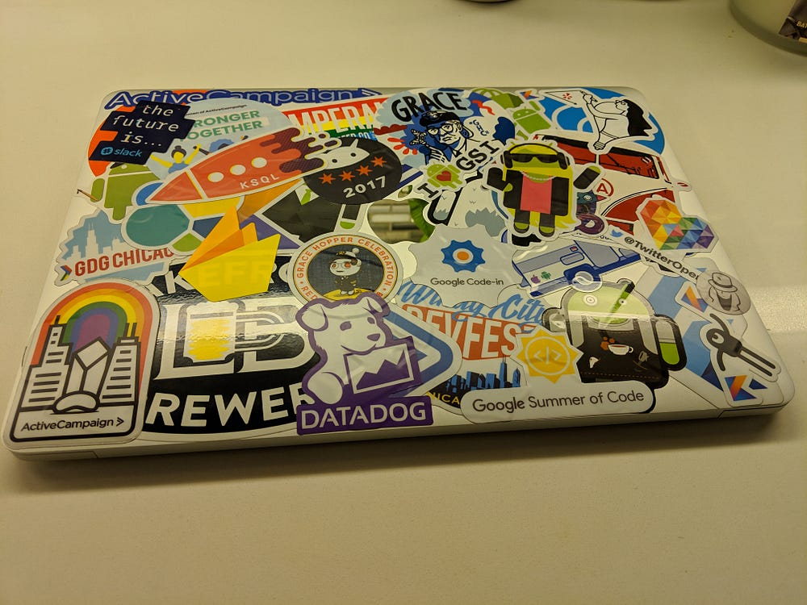
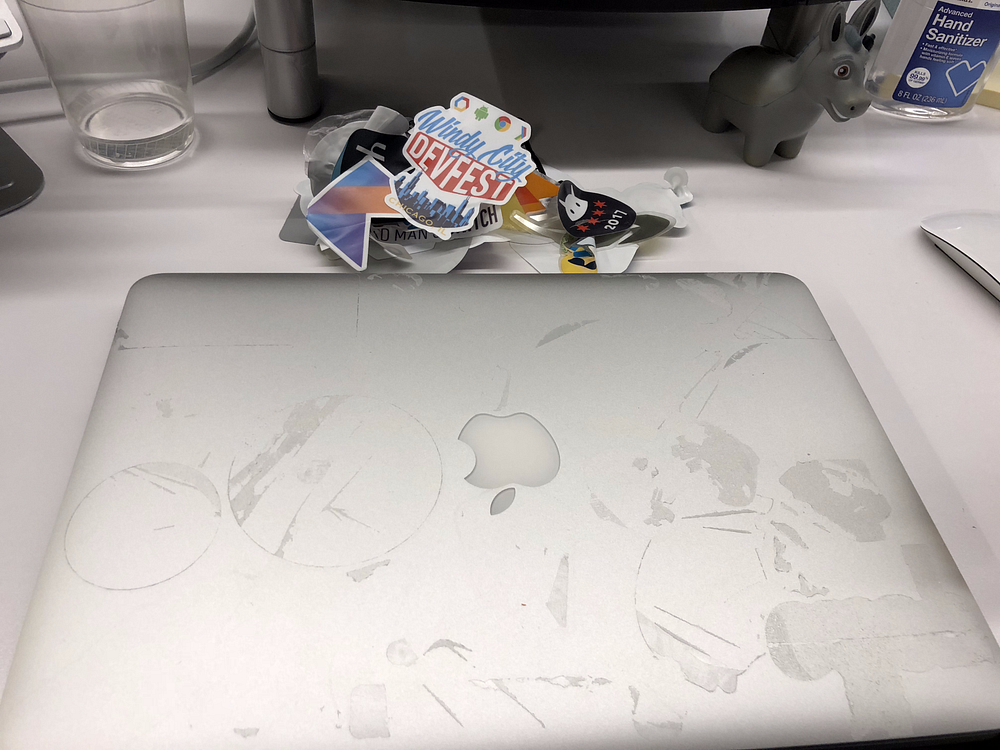
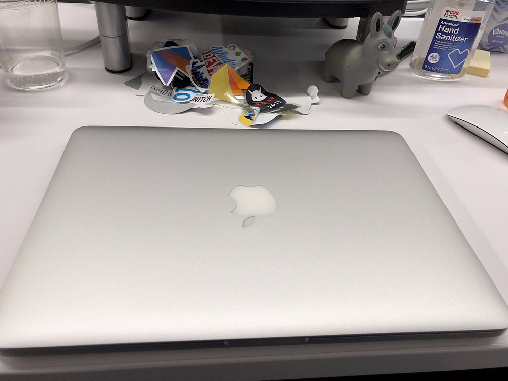

Picture this, you just handed your employer your resignation letter and you suddenly get this sinking feeling… What will the IT team think of me if I hand over this stickered up mess of a laptop? The task of removing all of the stickers may feel incredibly daunting, and this was something I went through myself earlier in the year. I wanted to share a simple how-to guide on how to remove stickers from your laptop and hopefully save face with your soon-to-be former IT department.

### A Razor Blade Is Your Best Friend

You should start off by removing the stickers using a razor blade to help you get a clean peel. If you're lucky this will remove all of the stickers and the sticker residue. If you're like myself you will find yourself left with some nasty residue reminding you of stickers past. If you find yourself in my predicament (pictured below) then keep reading.

### Grab Goo Gone And Keep That Razor

The next step in this process is to spray the laptop with [Goo Gone](https://amzn.to/2QJ2zZG) and leave it sit for five to ten minutes. After it has sat for a little bit take your razor blade and start scraping at the sticker residue, don't worry if you don't get all of it. Once you have scraped as much as you can grab a paper towel and wipe off the excess Goo Gone. Evaluate your current situation, if there is still a lot of residue repeat this section as needed.

### This Last Step Is Key

You may notice that there is still some residue on your laptop and that's fine because now is the part where I reveal the secret sauce. Grab [Medela Quick Clean Wipes](https://amzn.to/2Elrf4O) (these are sold for cleaning breast pumps so it's safe for electronics) and start scrubbing the laptop. You should notice that any left over residue should come off and you should be left with a clean laptop with no signs that it ever was a traveling billboard for different companies and programming languages.

### Are You Still Stuck On Step Zero?

At this point you might be yelling at your screen "BUT CODY, I DON'T HAVE A NEW JOB!" If you find yourself stuck in this rather awkward predicament, good luck out there! If this tutorial helped, feel free to share it with friends or colleagues navigating a job transition.