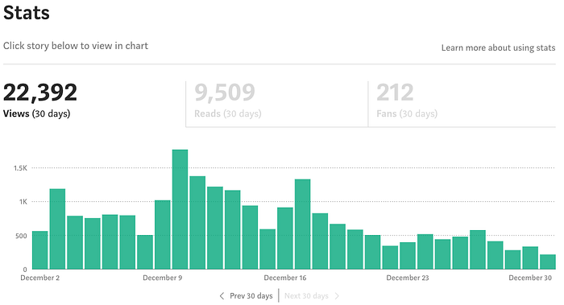

I decided late in November that I wanted to challenge myself to write 31
articles in 31 days during the month of December. I found that during
2018 I didn't write nearly as much as I had anticipated and was
disappointed in the growth I saw. I believe I started 2018 with around
500 followers and at the start of the year I thought 1,000 would be easy
to achieve — for the record I'm ending the year with around 731
followers. So I started writing articles daily and after I had a few
articles under my belt I published my declaration on December 3rd to
keep myself accountable.

I went strong for the first 20 days before ultimately failing on the
21st day. As with many of the articles I wrote this month I wanted to
take a moment to reflect on this journey and hopefully give some advice
to others that hope to do something similar in the future.

## Ending The Month With 25 Articles

At the end of this month I will have written 25 articles in 31 days.
That's 6 short of my goal but ultimately 25 more than I would have
written without that goal. I have a love/hate relationship with that
quote about shooting for the moon because if you miss you'll end up with
the stars; on one hand it's corny but on the other it illustrates my
month perfectly.

> Shoot for the moon and if you miss you will still be among the stars.

After getting over the initial dread of admitting defeat I found myself
still incredibly happy with what I had achieved during this month. I was
able to write articles ranging from [adaptive icons for Android](https://proandroiddev.com/android-adaptive-icons-are-easier-than-you-think-3c66be2dd4dd) to
why depression sucks. While the former would be something I'd likely
write given the motivation the latter is one I never would have written
had I not had failure looming over my head.

Each article was like starting with a blank canvas. I was able to take
little things I learned from the previous days and incorporate them into
what I was writing that day. I figured out a fairly quick routine for
finding header images and how to crop them to an aspect ratio that gave
my article an extra oomf without being the main focal point.

The articles I wrote also helped me refine my voice. My article on
depression gave me confidence to speak up about my issues as opposed to
bottle them in. Writing about my co-worker passing away helped me
collect my thoughts and grow as person. Writing about Dagger let me
break down a complex topic over the course of a week ([and may have sparked response articles that were better than my own](https://proandroiddev.com/dagger-2-on-android-the-simple-way-f706a2c597e9)).

### Over 22k Views Ain't Bad

While publishing all of these articles I was able to watch my views,
reads, and fans increase over the previous month. In a typical month I
was seeing around 15,000 views with 6,000 reads, and around 50 fans.
This month I saw over 22,000 views with over 9,000 reads and had over
200 fans.

If I dig deeper into my stats I can see that there was an immediate
benefit in writing articles about software engineering. There was a
fairly big drop-off when I wrote about non-software articles but at the
same time I received overwhelming support from colleagues when I wrote
those articles over the ones that boosted my stats.

## Writing Is No Longer Intimidating

At this point I'm not really anxious about writing new articles. I have
25 data points I can look to in the last month where I wrote an article
and nothing bad happened. In many cases I found that writing resulted in
good things happening. I had a former colleague share one of my articles
both on Facebook and LinkedIn and he shared his own thoughts on it. I
had a current colleague give me [bonusly](https://bonus.ly/) points for
the articles I was writing (I had no idea they were aware that I was
writing). Another colleague of mine messaged me to say a candidate
talked about me during their interview and it was my writing about
Kotlin that made them interested in ActiveCampaign.

While I don't think I'll try to write every single day ever again, I can
say that I am less anxious about writing. I am especially interested in
writing more about my general career advancement and targeting engineers
entering the workforce to see if I'm able to shed some light on their
questions. There are also a ton of questions floating around
[/r/cscareerquestions](https://www.reddit.com/r/cscareerquestions/) that
are fairly easy for me to answer at this point in my career.

So with that I'm excited to start writing less than I did this month but
more than I did previously. I'm excited that I'll have more time to do a
bit more research into various topics and form a stronger opinion one
way or another. The worst that can happen is I am able to reflect on
*some topic* just to have no one read it but overall I'll be a better
version of myself; the best case scenario is likely something I can't
even fathom so I'll go ahead and leave that blank.

## The Compound Effect And Habit Forming Is Real

Looking back on this entire month reminded me about two books I've read,
[*The Compound Effect*](https://amzn.to/2C28uzV) and [*The Power of Habit*](https://amzn.to/2BNkpRG). Both books are worth reading, but they share the similar
belief that habits are incredibly powerful things which can do a lot to
help or harm us. When I first started writing the articles this month I
found it to be fairly difficult to start writing, and yet by the end of
this experience it sort of became second nature.

### Sharing Ideas Was The Habit

I think the main habit I was building over the last few weeks was around
sharing ideas that were floating around in my head. It wasn't
necessarily writing every day that was important, it was being able to
express what I was thinking and share that with others. Sharing ideas is
also something that is becoming a core value of mine. The idea of being
open about something you believe and seeing how that can change the way
others think (or cause others to change the way you think) is exciting
to me. This is partly why I was so happy with this entire process, it
was helping me further live into a core belief of mine and helped to
reinforce it.

### Let Me Write About That Quick

This also helped me better communicate with my girlfriend. I think in
the past year I found it difficult to write because it meant taking away
*us time* from her. Since I set a goal that I wanted to achieve though
it helped with setting aside time to write and Jessica was able to see
the progress I was making and how excited I was to write. It has become
easier for me to write something because I just let her know that I have
something I'd like to write about and she knows that I should be free
again in an hour or two.

At a deeper level I think this also helped me realize that *me time* is
just as important to a relationship. In the past month I feel like I've
connected more with my girlfriend because I have valued our time
together more than I was before. I have also had a bit more alone time
where I've played video games and while it seems counterintuitive to me,
I think it's probably important to have designated alone time in any
relationship.

That turned into a bit of tangent, so let me try to tie this part
together. Building up a habit of sharing ideas and being able to express
those ideas quickly while being able to focus on it was a huge part of
this month for me. I'm happy that I have found my voice and I'm able to
write fairly easily.

## I Would Do Things Differently Though

It's hard to say that if I did things differently I would have found
more success. While I could have tweaked things to succeed at the goal
it's hard to say that I would have found the same success in other areas
(such as finding my voice, or trying out different things). Nonetheless,
I think I could have done some things differently which would have made
reaching my goal easier.

### Planning Ahead Of Time

I did not plan any of this ahead of time. I told myself I would write
one article a day and then just went with it. The first few articles
were fairly easy since they were technical subjects I wanted to write
about anyway. The next few were a little harder because I was going
through a low-point in the month and just didn't want to write about
much. I then found some success by breaking up a large topic into
smaller chunks that I could publish each day. Ultimately I ran out of
steam though and stopped writing.

I think had I planned out what I was going to write ahead of time it
would have at least removed the decision making process from my daily
routine. By not having to figure out what I was going to write about I'd
have more energy to actually write. This would have removed the
spontaneous nature of some of the articles (I wouldn't have planned to
write about depression), but I would have known if I had enough to write
about for a full month earlier on.

### Burning Out Happens

Burning out is something that just happens. I feel like I have natural
ebbs and flows where I go from too relaxed to too stressed and
ultimately burning out. This month I finally hit my breaking point on
day twenty. I went out for a few drinks after work to catchup with a
former-colleague. I ended up reflecting on how I felt at that point and
spent about a third of the article talking about burn out.

Routine isn't always something that works for me. I like showing up and
leaving from work at the same time, I like grocery shopping at the same
time, but I can't say I like feeling constrained with my free time.
There were some days this month where I wanted to spend my free time
writing code or reading about something new; instead I had to write.
Ultimately this resulted in me not writing one day and that was okay. I
think since I stopped writing the stuff I have written has gotten
better. While the statistics won't back it up I am very proud of my
most recent article responding to a question on Reddit. That article is
also one of my longest articles I have ever written and I was able to
write that in a couple hours.

### Set A Realistic Goal

Ultimately I think I focused on the *how* instead of the *what* or
*why*. I should have made my goal to reset my writing habits over the
course of a month. Then I could have focused on what I'd need to do to
accomplish that. In general I think starting out by writing an article a
day for 14 days would be do-able. I could easily plan out what I would
write about and stick to that plan. After that I could start shifting my
focus from quantity to quality articles which could allow for me to read
or write code that would serve as the basis for future articles.

Ultimately I think my biggest failure this month came from the goal I
set. It wasn't a good goal, it was just a thing I could do to achieve a
certain outcome. The benefit of this is I'm feeling better about setting
goals going into 2019. While I'm not completely sure on what they will
be I think they will follow the theme of *financial independence*,
*building better relationships*, and *putting my health first*. On
second thought maybe those should be my goals.

If this inspired you to try your own month-long challenge, feel free to share it with someone who might be up for the same.
